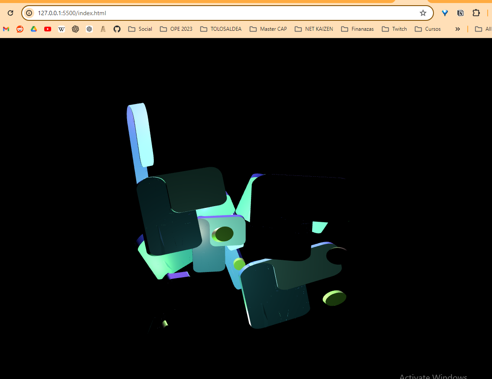

# Ingurunea prestatu

1. Sortu repositorio bat gihuben eta igo repositorio repositorio honetako proiektua
2. Sortu dockerren node garapen ingurune bat.
3. Jarraitu verge 3D-ko gida hau eta eskolako logoaren escena erabiliz kuboarena erabili beharrean. [verge 3D](https://www.soft8soft.com/docs/manual/en/programmers_guide/Using-NodeJS-NPM.html)
4. Ezarri webpack node referentziak errazago erabiltzeko.

# Ariketa

Aukeratu bat edo gehiago.

1. Sortu escena berri bat blenderren eta exportatu logoarena bezala.
2. Sortu webgune sinple baten egitura 3D escenaren gainean, tolosaldealogoak fondo bezala gelditu behar da eta rotazio mugimendu konstante batekin.
3. Jarraitu vergeko gida vue edo react aplikazio baten integratuz libreria [verge 3d react/vue](https://www.soft8soft.com/docs/manual/en/programmers_guide/Integration-with-Reactjs-Vuejs.html)

Entregatu dena zuen repositoriora igoz!